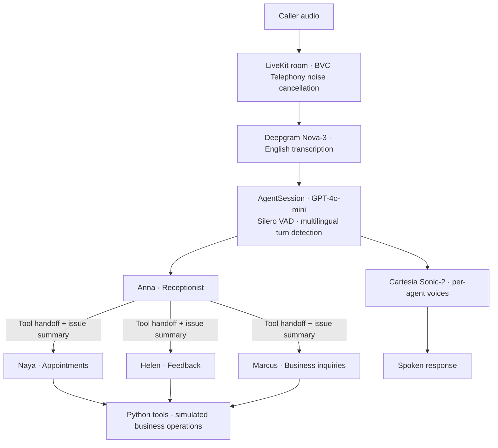

# Plumbing Voice AI Agent

A voice receptionist for a fictional plumbing company, built with LiveKit Agents. It routes callers to appointment, customer feedback, and business inquiry specialists, carrying a summary of the caller’s request into the handoff.

The product problem is simple: a caller should be able to explain what they need, reach the right workflow, and hear a clear next step without repeating their story. This project explores that experience through specialist agents, explicit tool calls, and conversational evaluations.

**Status:** A Python prototype with a real voice pipeline and simulated business operations. Booking, cancellation, feedback, and inquiries use an in-memory store isolated to each call. Availability uses the next three days; booking history reflects that call’s actual operations. Nothing persists after the session ends. The repository includes the agent worker, tests, and container configuration. A web client, telephone integration, and operator dashboard are outside the current implementation.

## Caller experience

| Caller intent | Agent | Workflow |
| --- | --- | --- |
| General questions or an unclear request | **Anna**, receptionist | Clarify the request and route to a specialist |
| Schedule, change, or cancel a visit | **Naya**, appointments | Look up sample availability, collect details, and call booking or cancellation tools |
| Share feedback about a service visit | **Helen**, customer feedback | Collect feedback and optionally associate it with a sample appointment |
| Offer services, apply for work, or discuss a partnership | **Marcus**, business development | Collect and categorize the inquiry |

For example, “My kitchen sink is leaking and I need someone to come out” should lead Anna to transfer the caller to Naya with the issue summary. Naya’s entry instructions use that summary to acknowledge the leak before continuing the scheduling conversation. This is the intended flow, not a recorded transcript or a measured success claim.

## Architecture and decisions



The worker starts in [agent.py](agent.py); prompts, tools, state, speech processing, and telemetry live in [plumbing/](plumbing/). Python 3.11+ and LiveKit Agents connect the speech, model, and business workflow layers in a single worker.

### Carry the issue through the handoff

A session-scoped `UserData` dataclass holds the agent registry, previous agent, and optional `problem_description`. Each transfer function records the current agent, stores a supplied summary, and returns the destination agent. The specialist’s `on_enter` reads the summary when generating its greeting.

All four agents are instantiated at session startup, so the normal handoff path reuses an existing object. This avoids constructing a specialist during a transfer; it does not establish a measured latency improvement or guarantee preservation of the full conversation history. The registered transfer tools currently belong to Anna, so specialist-to-specialist routing and return routing are future work.

### Keep each workflow focused

Each specialist has its own instructions, voice, and tool set. Naya gets appointment tools; Helen gets feedback and past-appointment tools; Marcus gets an inquiry submission tool. This makes the available actions easy to inspect and gives each conversation a narrower scope.

Business operations are exposed through `function_tool` handlers, providing clear integration points for a future backend. The booking tool validates required fields, US address format, ZIP code, and phone format before reserving a slot. These are format checks, not address deliverability or phone ownership verification. Repeated bookings return the same tracking ID, and conflicting reservations are rejected within the session.

### Design for spoken interaction

Prompts favor short responses, acknowledgment, and clarification before action. The session combines Silero voice activity detection with LiveKit’s multilingual turn detector and configures BVC Telephony noise cancellation. Transcription is explicitly configured for English; the turn detector’s name does not imply multilingual product support.

`VoiceAgent.tts_node` cleans streamed text before handing it to LiveKit’s default synthesis node, preserving phone-number hyphens and other meaningful punctuation. Offline tests exercise the installed SDK’s actual default node with a fake speech transport and split input at every character boundary. Pronunciation and perceived audio quality still require live provider testing. See [LiveKit’s pipeline hook documentation](https://docs.livekit.io/agents/logic/nodes/).

## Try it without subscriptions

Python 3.11+ and `uv` are sufficient for the offline workflow. Initial setup downloads public dependencies; tests and the scripted demo require no API keys or model downloads.

```bash
make setup-dev
make demo
make test
```

`make demo` runs the actual booking logic: reject an invalid phone number, reserve a slot, retry without creating a duplicate, look up the appointment, and cancel it. This is a scripted business workflow, not a simulated claim of a working AI conversation.

Offline tests replace provider boundaries with fakes and block Python socket connections. They exercise booking validation, state changes, handoff greetings, streaming speech cleanup, session wiring, and structured event handling. Provider-backed conversation evaluations are explicitly skipped by default.

## Run the voice worker

For real speech, configure LiveKit, OpenAI, Deepgram, and Cartesia credentials:

```bash
make env-setup
# Edit .env.local with your credentials.
make download
make run-console
```

The [.env.sample](.env.sample) template contains the required variables. `NEXT_PUBLIC_LIVEKIT_URL` is unused by the Python worker. Missing runtime configuration is reported by variable name without printing credential values.

| Command | Purpose |
| --- | --- |
| `make run-console` | Local voice interaction using a microphone and speakers or headphones |
| `make run-dev` | Development worker connected to LiveKit |
| `make run-prod` | Start a worker in the current environment; this does not deploy it |

Room-based development requires a separate client connected to the same LiveKit project. Try “My kitchen sink is leaking. Can I schedule a plumber?” and listen for Naya to acknowledge the issue after Anna’s handoff. Booking uses future demo slots and explicitly confirms that no technician will be dispatched.

## Testing and debugging

| Command | Coverage |
| --- | --- |
| `make test` | All offline tests; provider evaluations explicitly skipped |
| `make test-basic` | Initialization, tools, and text cleanup |
| `make test-handoffs` | Direct handoff state and greeting checks; live evaluations skipped |
| `make test-edge-cases` | Booking validation, streamed text, configuration, and telemetry |
| `make test-coverage` | Offline coverage with missing lines reported |
| `make test-verbose` | Detailed offline output |
| `make test-provider` | Opt-in provider-backed evaluations; requires credentials and may incur charges |

The legacy conversation evaluations use an LLM to judge response intent. They remain unverified against live providers; a green offline run does not establish conversational quality or provider compatibility. Actual audio, interruption handling, outages, and telephone integration require separate end-to-end testing. See [TESTING.md](TESTING.md) for the boundary between offline checks and live evaluations.

Operational events use the `plumbing.events` logger. JSON records correlate handoffs, agent state, tool outcomes, provider errors, and SDK timing metrics with a session ID. Customer transcripts, tool arguments, and tool outputs are omitted. LLM time to first token and TTS time to first byte are provider metrics, not a measurement of end-to-end perceived latency.

## Container and deployment configuration

The [Dockerfile](Dockerfile) uses Python 3.11 slim Bookworm, installs dependencies from `uv.lock` with `uv sync --locked`, and runs as a non-root user. Model assets are downloaded during the build, so the build requires internet access but no paid provider calls.

```bash
docker build -t plumbing-voice-agent .
docker run --rm plumbing-voice-agent python -m plumbing.demo
# For the real worker, after configuring credentials:
docker run --rm --env-file .env.local plumbing-voice-agent
```

[livekit.toml](livekit.toml) contains an existing Cloud project subdomain, agent ID, and `us-east` region. Configure your own deployment target before using it. The locked SDK baseline is retained; this change does not claim an upgrade or a dependency vulnerability audit.

## Next steps toward a production product

1. **Persist bookings across calls.** Replace the session-local store with a shared database, transactional reservations, and durable idempotency. The current store prevents conflicts only within one call.
2. **Make failures recoverable.** Add provider timeouts, explicit failure responses, and a human escalation path. Define how urgent requests leave the automated workflow.
3. **Make conversations inspectable.** Add an operator view for transcripts, tool outcomes, handoffs, and timings, building on the structured events.
4. **Measure the caller experience.** Run repeatable audio scenarios to evaluate interruptions, handoff continuity, and speech output; track completion and repeated-information requests.
5. **Verify live integrations.** Establish a provider-backed evaluation baseline before upgrading the SDK or promising deployment readiness.

## Repository guide

| Path | Contents |
| --- | --- |
| [agent.py](agent.py) | Worker configuration and session startup |
| [plumbing/agents.py](plumbing/agents.py) | Specialist prompts and handoffs |
| [plumbing/business.py](plumbing/business.py) / [plumbing/tools.py](plumbing/tools.py) | Validated demo store and LiveKit tool adapters |
| [plumbing/speech.py](plumbing/speech.py) | Streaming TTS text processing |
| [plumbing/state.py](plumbing/state.py) / [plumbing/config.py](plumbing/config.py) | Session state and environment validation |
| [plumbing/telemetry.py](plumbing/telemetry.py) | Structured operational events |
| [plumbing/demo.py](plumbing/demo.py) | Credential-free scripted booking workflow |
| [tests/](tests/) | Offline checks and opt-in provider evaluations |
| [Makefile](Makefile) | Setup, demo, run, and test commands |
| [pyproject.toml](pyproject.toml) / [uv.lock](uv.lock) | Dependency declarations and locked resolution |
| [Dockerfile](Dockerfile) / [livekit.toml](livekit.toml) | Container and deployment configuration |
