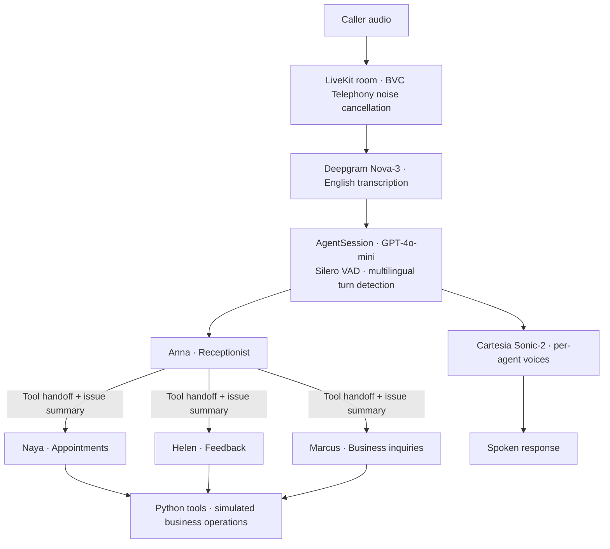

# Plumbing Voice AI Agent

A voice receptionist for a fictional plumbing company, built with LiveKit Agents. It routes callers to appointment, customer feedback, and business inquiry specialists, carrying a summary of the caller’s request into the handoff.

The product problem is simple: a caller should be able to explain what they need, reach the right workflow, and hear a clear next step without repeating their story. This project explores that experience through specialist agents, explicit tool calls, and conversational evaluations.

**Status:** A Python prototype with a real voice pipeline and simulated business operations. Booking and cancellation produce confirmations without persisting changes; availability is hardcoded and appointment history is randomly generated. The repository includes the agent worker, tests, and container configuration. A web client, telephone integration, and operator dashboard are outside the current implementation.

## Caller experience

| Caller intent | Agent | Workflow |
| --- | --- | --- |
| General questions or an unclear request | **Anna**, receptionist | Clarify the request and route to a specialist |
| Schedule, change, or cancel a visit | **Naya**, appointments | Look up sample availability, collect details, and call booking or cancellation tools |
| Share feedback about a service visit | **Helen**, customer feedback | Collect feedback and optionally associate it with a sample appointment |
| Offer services, apply for work, or discuss a partnership | **Marcus**, business development | Collect and categorize the inquiry |

For example, “My kitchen sink is leaking and I need someone to come out” should lead Anna to transfer the caller to Naya with the issue summary. Naya’s entry instructions use that summary to acknowledge the leak before continuing the scheduling conversation. This is the intended flow, not a recorded transcript or a measured success claim.

## Architecture and decisions



The implementation lives in [agent.py](agent.py). Python 3.11+ and LiveKit Agents connect the speech, model, and business workflow layers in a single worker.

### Carry the issue through the handoff

A session-scoped `UserData` dataclass holds the agent registry, previous agent, and optional `problem_description`. Each transfer function records the current agent, stores a supplied summary, and returns the destination agent. The specialist’s `on_enter` reads the summary when generating its greeting.

All four agents are instantiated at session startup, so the normal handoff path reuses an existing object. This avoids constructing a specialist during a transfer; it does not establish a measured latency improvement or guarantee preservation of the full conversation history. The registered transfer tools currently belong to Anna, so specialist-to-specialist routing and return routing are future work.

### Keep each workflow focused

Each specialist has its own instructions, voice, and tool set. Naya gets appointment tools; Helen gets feedback and past-appointment tools; Marcus gets an inquiry submission tool. This makes the available actions easy to inspect and gives each conversation a narrower scope.

Business operations are exposed through `function_tool` handlers, providing clear integration points for a future backend. Address, ZIP code, and phone checks currently live in Naya’s prompt. Enforcing those rules in code before accepting a booking is still required.

### Design for spoken interaction

Prompts favor short responses, acknowledgment, and clarification before action. The session combines Silero voice activity detection with LiveKit’s multilingual turn detector and configures BVC Telephony noise cancellation. Transcription is explicitly configured for English; the turn detector’s name does not imply multilingual product support.

`clean_text` and the `CleanTTS.say` override attempt to remove Markdown characters before speech. Unit tests cover the string transformation, but they do not verify that the streaming synthesis path uses the override. Audio-level verification belongs in the next iteration, including checking that cleanup preserves meaningful punctuation.

## Run locally

You need Python 3.11+, `uv`, and credentials for LiveKit, OpenAI, Deepgram, and Cartesia. Run these commands from the repository root:

```bash
make setup-dev
make env-setup
```

`make env-setup` creates `.env.local` from [.env.sample](.env.sample) only if it does not already exist. Fill in these values:

```dotenv
LIVEKIT_URL=wss://your-project.livekit.cloud
LIVEKIT_API_KEY=your-livekit-api-key
LIVEKIT_API_SECRET=your-livekit-api-secret
OPENAI_API_KEY=your-openai-api-key
DEEPGRAM_API_KEY=your-deepgram-api-key
CARTESIA_API_KEY=your-cartesia-api-key
```

The template also includes `NEXT_PUBLIC_LIVEKIT_URL`; the Python worker does not use it. `.env.local` is ignored by Git.

Download the required model assets, then start a local session:

```bash
make download
make run-console
```

Console mode is the local voice entry point; use a microphone and speakers or headphones to exercise the speech pipeline.

| Command | Purpose |
| --- | --- |
| `make run-console` | Run `uv run agent.py console` for local interaction |
| `make run-dev` | Run `uv run agent.py dev` for development against LiveKit |
| `make run-prod` | Run `uv run agent.py start` to start a worker that waits for jobs |

Room-based development requires a separate client connected to the same LiveKit project. `make run-prod` starts the worker in the current environment; it does not deploy the application to LiveKit Cloud.

### Try these scenarios

- **Booking:** “My kitchen sink is leaking. Can I schedule a plumber?” Listen for Naya to acknowledge the issue after the transfer.
- **Feedback:** “I want to leave feedback about my last visit.” Follow Helen’s collection and summary flow.
- **Business inquiry:** “I supply plumbing equipment and would like to discuss a partnership.” Follow Marcus’s inquiry flow.
- **Correction:** Give an incomplete phone number during scheduling, then correct it. Inspect how the agent asks for clarification.

Use fictional customer details: the mock tools print submitted information to the console. Availability uses fixed September 2025 dates, and generated appointment history may contain invalid dates. These fixtures need updating for a realistic scheduling demo.

## Testing and debugging

The suite combines direct Python assertions with LiveKit conversation tests that use an LLM to judge response intent. This covers different questions: whether tools and handoff state are wired correctly, and whether the response fits the caller’s request.

After installing development dependencies and configuring credentials:

```bash
make test-basic       # Initialization, tool registration, and text cleanup
make test-behavior    # Conversation evaluations in tests/test_final.py
make test-handoffs    # Selected handoff tests
make test-edge-cases  # Selected edge-case tests
make test            # Full suite
make test-coverage   # Full suite with coverage output
```

The handoff and edge-case Make targets run explicit subsets, not their entire files. The Makefile notes possible failures in more complex cases; a passing subset should not be treated as a passing full suite. Conversation evaluations call OpenAI and may incur usage charges; provider configuration is also needed when tests instantiate speech components. These evaluations are not a substitute for testing actual audio, interruptions, or provider outages.

For detailed evaluation output:

```bash
make test-verbose
```

Start debugging with the tool outputs and transfer messages in the console. The worker currently uses `print` statements; structured tracing and latency dashboards are not implemented.

## Container and deployment configuration

The [Dockerfile](Dockerfile) uses a single Python 3.11 slim Bookworm stage, installs dependencies with `pip`, switches to a non-root user, downloads model assets, and starts the worker with `python agent.py start`.

[livekit.toml](livekit.toml) contains an existing LiveKit Cloud project subdomain, agent ID, and `us-east` region configuration. Configure your own deployment target before using it. Local setup uses `uv`; the Docker build currently installs from `pyproject.toml` without consuming `uv.lock`, so local and container dependency resolution are not yet aligned.

## Next steps toward a production product

1. **Make bookings trustworthy.** Replace mock operations with persistent storage, validate inputs in code, and add idempotency and transactional slot reservation. A spoken confirmation should correspond to a committed booking.
2. **Make failures recoverable.** Add provider timeouts, explicit failure responses, and a human escalation path. Define how urgent requests leave the automated workflow.
3. **Make conversations inspectable.** Build an operator view that connects transcripts, tool inputs and results, handoffs, and errors. Capture time to first audio and provider latency so a slow or failed turn can be investigated.
4. **Measure the caller experience.** Use repeatable audio scenarios to evaluate interruptions, handoff continuity, and speech output. Track booking completion, repeated-information requests, and time to a confirmed next step, then iterate from observed failures.
5. **Tighten the developer loop.** Separate deterministic tests from provider-backed evaluations, establish a passing CI baseline, and align container builds with the lockfile.

## Repository guide

| Path | Contents |
| --- | --- |
| [agent.py](agent.py) | Agent instructions, session setup, handoffs, and mock business tools |
| [tests/](tests/) | Unit, conversation, handoff, edge-case, and entrypoint tests |
| [Makefile](Makefile) | Setup, run, and test commands |
| [pyproject.toml](pyproject.toml) / [uv.lock](uv.lock) | Dependency declarations and local lockfile |
| [.env.sample](.env.sample) | Credential template |
| [Dockerfile](Dockerfile) / [livekit.toml](livekit.toml) | Container build and Cloud deployment configuration |
